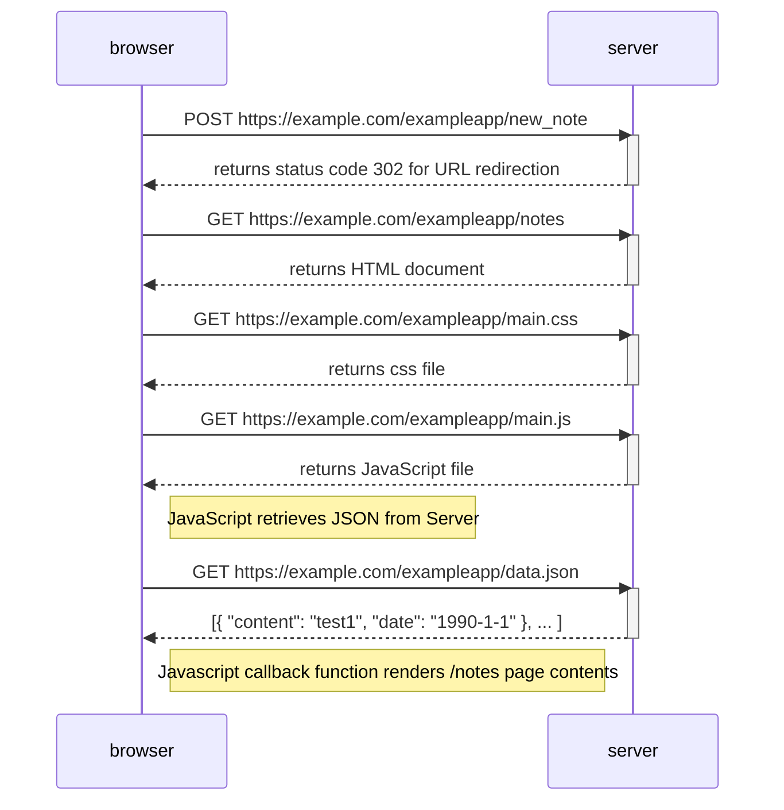
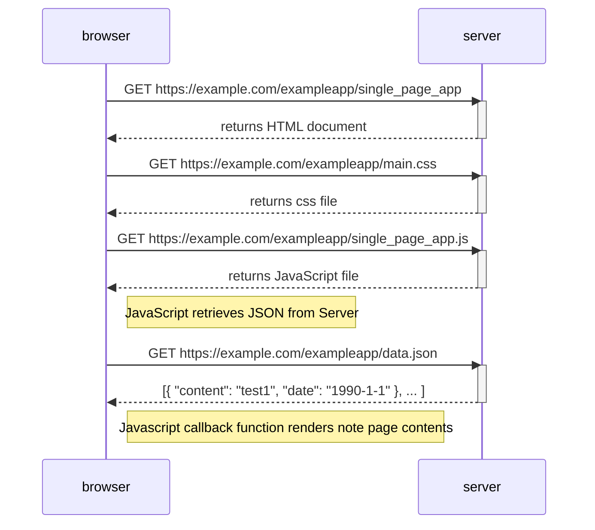
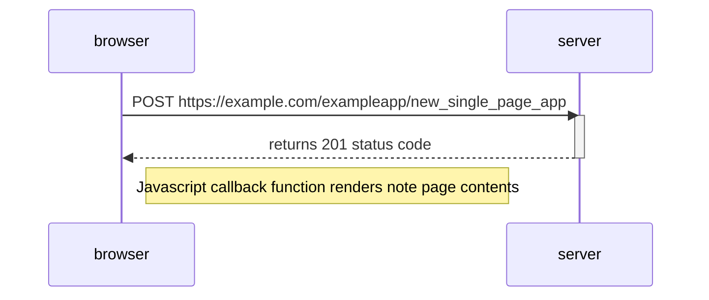

## 0.1 HTML

https://developer.mozilla.org/en-US/docs/Learn/Getting_started_with_the_web/HTML_basics 

## 0.2 CSS

https://developer.mozilla.org/en-US/docs/Learn/Getting_started_with_the_web/CSS_basics

## 0.3 Forms

https://developer.mozilla.org/en-US/docs/Learn/Forms/Your_first_form

## 0.4 New note diagram

This diagram explains the chain of events when a user creates a new note on the `/notes` page. A note is added as a bullet point on the webpage. The text content is sent as a form input to the server which triggers a page redirect to refresh/reload the `/notes` page.

Server side handles adding the content to the webpage. 

## 0.5 Single page app diagram

These are the sequence of events when a user visits the `single_page_app` webpage.

## 0.6 New note in Single page app diagram

These are the sequence of events when a user submits a form value on the `/single_page_app` webpage.

The text content from the form submission is added to page from the browser side. The server side do not update the page and `/single_page_app` is not reloaded.

On the client side (browser runtime or runtime environment):

Javascript listens for an event trigger (this action is called event handling) such as a form submission.

In this function, the default GET request (that will cause a redirection/reload) is suppressed.

The function sends a POST request to the server containing the form value as a JSON object.The server responds with a 201 status code to acknowledge successful creation.

In the same function, the JSON object is pushed to a global array. The function to render the bullet points on the webpage using the global array is called. 

Hence, updates to the webpage is managed only by the browser. 

The script's contents can be found at: https://github.com/mluukkai/example_app/blob/master/public/spa.js 

